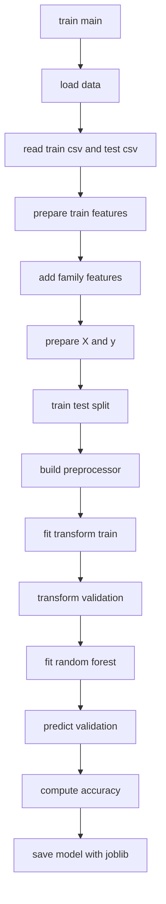
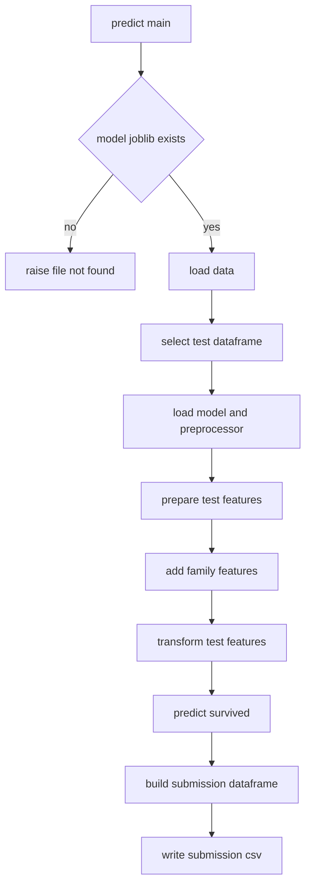

# Titanic ML Lab (Beginner Friendly)

This project trains a `RandomForestClassifier` on the Titanic dataset and creates a `submission.csv` file for test predictions.

## Project Structure

- `src/preprocess.py`: data loading, cleaning, feature engineering, and preprocessing pipeline
- `src/train.py`: model training and validation accuracy report
- `src/predict.py`: test-set prediction and `submission.csv` creation
- `notebooks/titanic_analysis.ipynb`: beginner walkthrough notebook
- `requirements.txt`: required Python packages

## Requirements

- Python 3.9+
- Titanic files:
  - `data/train.csv`
  - `data/test.csv`

Install dependencies:

```bash
pip install -r requirements.txt
```

## What This Project Does

1. Reads `train.csv` and `test.csv` from `data/`
2. Performs data cleaning:
   - fills missing `Age` and `Fare` with median
   - fills missing `Embarked` with most frequent value
3. One-hot encodes categorical columns (`Sex`, `Embarked`)
4. Creates new features:
   - `FamilySize = SibSp + Parch + 1`
   - `IsAlone` (1 if family size is 1, else 0)
5. Trains a `RandomForestClassifier`
6. Evaluates accuracy on a validation split
7. Generates `submission.csv` for test predictions

## Run

From project root:

```bash
python src/train.py
python src/predict.py
```

After running, you should see:

- `models/model.joblib`
- `submission.csv`

## Pipeline Flow

### Training Flow (`python src/train.py`)



### Prediction Flow (`python src/predict.py`)



## Notes for Beginners

- Start with `notebooks/titanic_analysis.ipynb` if you want to understand each step interactively.
- The scripts in `src/` are the same logic in reusable Python modules.
